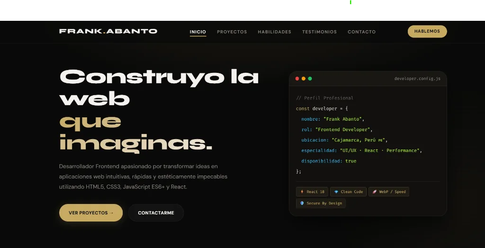

# ⚡ Frank Abanto — Portafolio Web Profesional

<div align="center">
  <p align="center">
    <strong>Desarrollador Frontend · Experiencias Web Modernas, Limpias y de Alto Rendimiento</strong>
  </p>

  <p align="center">
    <a href="https://frankusqabant.github.io/portafolio-adaptable-bootstrap/">
      
    </a>
    
    
    
  </p>

  <br />

  <a href="https://frankusqabant.github.io/portafolio-adaptable-bootstrap/">
    
  </a>

  <br><br>
</div>

---

## 🎯 Sobre el Portafolio

Sitio web personal y portafolio interactivo de **Frank Abanto**, Desarrollador Frontend radicado en Cajamarca, Perú. 

Diseñado desde cero con una estética editorial **Dark Gold Glassmorphism**, priorizando la velocidad de carga, la accesibilidad, el código semántico y una experiencia visual inmersiva para destacar proyectos, habilidades y testimonios.

> 🔗 **Explorar en producción:** [frankusqabant.github.io/portafolio-adaptable-bootstrap](https://frankusqabant.github.io/portafolio-adaptable-bootstrap/)

---

## ✨ Puntos Clave de Identidad y Diseño

| Pilar | Descripción |
|---|---|
| 🖥️ **Hero con Terminal Card** | Visualización interactiva tipo IDE (`developer.config.js`) con metadatos del desarrollador y badges técnicos. |
| 🎨 **Estética Dark Gold** | Paleta sofisticada con base `#0a0a09`, acentos dorados `#C6A962`, bordes en cristal templado y tipografía `Syne` + `DM Sans`. |
| ⚡ **Optimización Extrema (WebP)** | Todos los recursos visuales comprimidos a `.webp`, con soporte `loading="lazy"` y `decoding="async"`. |
| 📬 **Formulario Funcional** | Integración directa con servicio de mensajería sin requerir un backend dedicado ni exponer credenciales privadas. |
| 🧭 **ScrollSpy & Responsive** | Menú adaptable con detección activa de secciones en tiempo real y navegación fluida entre vistas. |
| 🛡️ **Seguridad Web Estricta** | Sanitización contra XSS, metadatos `referrer`, prevención de *Reverse Tabnabbing* (`rel="noopener noreferrer"`). |

---

## 🛠️ Tecnologías Empleadas

- **Frontend Core:** HTML5 Semántico, CSS3 Puro (Custom Properties, Flexbox, CSS Grid).
- **Lógica & Interactividad:** JavaScript ES6+ Vanilla (sin dependencias innecesarias).
- **Tipografía:** [Google Fonts](https://fonts.google.com/) (`Syne` para titulares / `DM Sans` para lectura y cuerpo).
- **Despliegue & CI/CD:** GitHub Actions + GitHub Pages.

---

## 📂 Estructura del Proyecto

```text
portafolio-adaptable-bootstrap/
├── .github/
│   └── workflows/
│       └── deploy.yml          # Pipeline CI/CD automático para GitHub Pages
├── css/
│   └── style.css               # Sistema de diseño, variables, glassmorphism y media queries
├── js/
│   └── main.js                 # Lógica de navegación, ScrollSpy, menú móvil y formulario
├── imagenes/
│   ├── readme/
│   │   └── preview-hero.webp   # Captura optimizada de alta resolución
│   ├── imagenes-desarrolladores/ # Recursos de testimonios y clientes
│   └── *.webp                  # Capturas de proyectos optimizadas
├── index.html                  # Arquitectura semántica principal
└── README.md                   # Documentación oficial del repositorio
```

---

## 🚀 Ejecución en Entorno Local

Para explorar o editar el portafolio en tu máquina local:

```bash
# 1. Clonar el repositorio
git clone https://github.com/FrankUsqAbant/portafolio-adaptable-bootstrap.git

# 2. Ingresar a la carpeta
cd portafolio-adaptable-bootstrap

# 3. Iniciar un servidor local (opciones rápidas):
# Con Python:
python -m http.server 3000

# O con Node / NPX:
npx serve -l 3000 .
```

Abre tu navegador en `http://localhost:3000` para visualizar el portafolio.

---

<div align="center">
  <sub>Diseñado y desarrollado con pasión por <strong>Frank Abanto</strong> · Cajamarca, Perú · 2026</sub>
</div>